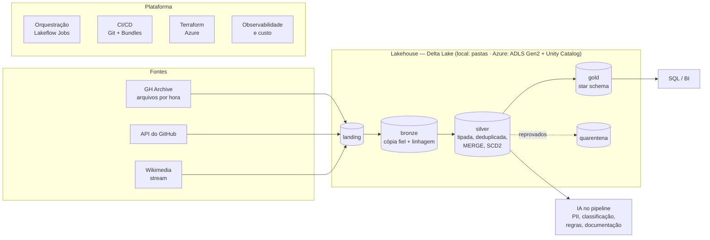

# oss-lakehouse

Um lakehouse completo sobre dados públicos do ecossistema open source — **PySpark, Delta Lake, Databricks, Azure e IA aplicada à engenharia de dados** — construído como trilha de 18 notebooks executados, apoiados num pacote Python testado.

Cada notebook explica **o que é, por que existe, como funciona e quando não usar**, mostra o código rodando com a evidência (plano de execução, contagem, antes/depois) e fecha com perguntas de entrevista respondidas.

> **Por onde começar:** [`00 · Mapa de competências e arquitetura`](notebooks/00_mapa_de_competencias_e_arquitetura.ipynb) · [`GUIA_DE_ESTUDO.md`](GUIA_DE_ESTUDO.md) (199 perguntas com resposta, por tema)

## Os dados

| Fonte | O que é | O que exercita |
|---|---|---|
| [GH Archive](https://www.gharchive.org/) | Todos os eventos públicos do GitHub, um JSON.gz por hora (~92 mil eventos/hora, 16 tipos, `payload` diferente por tipo) | Ingestão incremental de arquivos, schema semiestruturado, volume, skew real (um bot gera ~11% dos eventos) |
| API REST do GitHub | Metadados de repositórios | Paginação, rate limit, ETag, retry, marca d'água |
| [Wikimedia EventStreams](https://stream.wikimedia.org/) | Edições da Wikipedia em tempo real | Structured Streaming, watermark, janelas, exactly-once |

## Arquitetura



O mesmo código roda **local** (Spark 4.2 + Delta 4.4, pastas em `data/`) e no **Databricks/Azure** (o que muda é a raiz dos caminhos e a sessão). As decisões estão registradas como ADRs em [`docs/adr/`](docs/adr/).

## A trilha

| # | Notebook | O que demonstra |
|---|---|---|
| 00 | [Mapa de competências e arquitetura](notebooks/00_mapa_de_competencias_e_arquitetura.ipynb) | Competência → onde aparece; Lakehouse, Medallion, batch × streaming; roteiro de demonstração |
| 01 | [Ambiente: local, Databricks e Azure](notebooks/01_ambiente_local_databricks_azure.ipynb) | Driver/executor, configuração da sessão, tipos de compute, paridade local × Databricks |
| 02 | [Python avançado](notebooks/02_python_avancado.ipynb) | Generators, decorators, typing, pydantic, concorrência, pytest — com dados reais |
| 03 | [Ingestão incremental de arquivos](notebooks/03_ingestao_arquivos_auto_loader.ipynb) | Checkpoint, exactly-once, registro corrompido, backfill, Auto Loader |
| 04 | [Ingestão de API incremental](notebooks/04_ingestao_api_incremental.ipynb) | Paginação, rate limit, ETag, retry com backoff, marca d'água |
| 05 | [Bronze → Silver, MERGE e SCD2](notebooks/05_bronze_silver_merge_scd2.ipynb) | Deduplicação, MERGE idempotente, SCD tipo 2 com dado atrasado, deletion vectors |
| 06 | [Streaming](notebooks/06_streaming_structured_streaming.ipynb) | Watermark, janelas, `foreachBatch`, garantias de entrega |
| 07 | [Gold: modelagem dimensional](notebooks/07_gold_modelagem_dimensional.ipynb) | Star schema, grão, surrogate key, join point-in-time, Liquid Clustering |
| 08 | [Qualidade e contratos](notebooks/08_qualidade_e_contratos.ipynb) | Expectations, quarentena, contrato de dados, freshness, pipelines declarativos |
| 09 | [Performance no Spark](notebooks/09_performance_spark.ipynb) | Plano físico, shuffle, AQE, skew e salting, broadcast, small files, data skipping |
| 10 | [Delta Lake por dentro](notebooks/10_delta_lake_por_dentro.ipynb) | Transaction log, conflito de escrita real, time travel, VACUUM, CDF |
| 11 | [Governança, Unity Catalog e LGPD](notebooks/11_governanca_unity_catalog_lgpd.ipynb) | Grants, row filter, column mask, pseudonimização, direito à eliminação |
| 12 | [IA aplicada à engenharia de dados](notebooks/12_ia_aplicada_engenharia_de_dados.ipynb) | LLM no pipeline com gabarito, custo, guardrails e humano no circuito |
| 13 | [Git, CI/CD e Bundles](notebooks/13_cicd_git_asset_bundles.ipynb) | Trunk-based, versionamento, Declarative Automation Bundles, GitHub Actions |
| 14 | [Azure com Terraform + Azurite](notebooks/14_azure_terraform_azurite.ipynb) | ADLS Gen2, identidade gerenciada, Key Vault, Unity Catalog como código |
| 15 | [Observabilidade e custo](notebooks/15_observabilidade_e_custo.ipynb) | Registro de execuções, SLI/SLO, alertas, system tables, FinOps |
| 16 | [Live coding: SQL e PySpark](notebooks/16_live_coding_sql_pyspark.ipynb) | Exercícios clássicos resolvidos nas duas linguagens, com as pegadinhas |
| 17 | [Simulado de system design](notebooks/17_simulado_system_design.ipynb) | Quatro casos de arquitetura e um runbook de troubleshooting |

Legenda usada nos notebooks: 🧪 roda local · ☁️ só no Databricks/Azure (código mostrado, não executado aqui).

## Como rodar

Pré-requisitos: Java 17, [uv](https://docs.astral.sh/uv/) e `make`. Docker e Terraform só para o notebook 14.

```bash
make setup      # instala as dependências
make data       # baixa um dia do GH Archive (~470 MB) — o único passo que precisa de internet
make demo       # bronze → silver → gold → quality + consultas de negócio
make test       # suíte de testes (Spark local)
make nb N=05    # gera e executa um notebook
make guia       # regenera o GUIA_DE_ESTUDO.md a partir dos notebooks
```

`make help` lista todos os comandos.

## Estrutura

```text
notebooks/_src/     fonte dos notebooks em .py (jupytext) — diff legível e code review
notebooks/          .ipynb gerados e executados (as saídas são versionadas de propósito)
src/oss_lakehouse/  o pacote: bronze, silver, scd2, gold, quality, streaming, governance,
                    observability, perf, delta_log, ai/, sources/, pipeline, cli
tests/              testes unitários e de integração (pytest + chispa), sem rede
contracts/          contratos de dados em YAML
evals/              gabaritos para avaliar as etapas com LLM + planilhas de revisão humana às cegas
infra/              Terraform da Azure e Azurite (emulador do Azure Storage)
resources/          job do Databricks (bronze → silver → gold → quality)
docs/               ADRs, contratos das tabelas, guia de estilo dos notebooks
```

## O que é laboratório e o que não é

Este repositório é um **laboratório de estudo e demonstração**, e é honesto sobre os limites:

- **Roda de verdade, local:** tudo o que está marcado 🧪 — Spark, Delta Lake, streaming, MERGE, SCD2, qualidade, performance, testes. Todo número citado num notebook saiu de uma célula executada.
- **Código pronto, não implantado:** o Terraform da Azure passa em `terraform validate`, e o bundle do Databricks é validado contra o schema oficial — mas nenhum dos dois foi aplicado numa conta real. Recursos exclusivos da plataforma (Auto Loader, Unity Catalog, Photon, system tables, `ai_query`) aparecem marcados ☁️, como código não executado.
- **Medições de tempo:** feitas num laptop; valem pela ordem de grandeza e pelo plano de execução, não pelo valor absoluto.
- **IA:** as respostas do modelo foram gravadas uma vez e são reproduzidas do cache (offline e determinístico). Os gabaritos de avaliação são pequenos e foram rotulados com apoio de assistente de IA — o notebook 12 discute o que isso significa para os números, e `evals/revisao_humana/` traz o passo que falta: rotulagem humana às cegas com medida de concordância (kappa de Cohen).

## Sobre os dados

GH Archive, API do GitHub e Wikimedia EventStreams são fontes públicas (confira os termos de uso de cada uma antes de redistribuir). Os logins que aparecem são públicos, mas continuam sendo dado pessoal — o notebook 11 trata disso.
