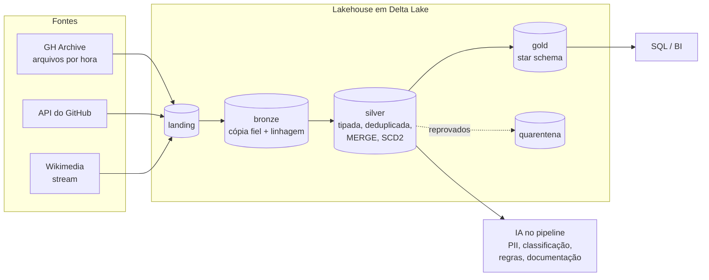

# oss-lakehouse

[](https://github.com/alanjoffre/oss-lakehouse/actions/workflows/ci.yml)


[](LICENSE)

Um lakehouse completo sobre **dados públicos reais** — os eventos do GitHub e as edições da Wikipedia —, construído como
uma trilha de **18 notebooks executados** apoiados num **pacote Python testado**. Cobre o trabalho de engenharia de dados
de ponta a ponta: ingestão incremental, MERGE e SCD2, streaming, modelagem dimensional, qualidade, performance no Spark,
Delta Lake por dentro, governança e LGPD, IA dentro do pipeline, CI/CD e infraestrutura na Azure.

Cada notebook explica **o que é, por que existe, como funciona e quando não usar**, mostra o código rodando com a
evidência — plano de execução, contagem, antes e depois — e termina com perguntas respondidas.

---

## Em um minuto

| | |
|---|---|
| **O que é** | Um pipeline *medallion* (bronze → silver → gold) em PySpark e Delta Lake, com o mesmo código rodando local e no Databricks |
| **Com que dado** | ~279 mil eventos reais do GitHub em 3 horas (2,2 milhões no dia usado no estudo de performance), 16 tipos de evento, JSON semiestruturado |
| **O que entrega** | 18 notebooks executados (387 células de código, nenhuma com erro), um pacote com ~6 mil linhas e uma suíte com mais de 180 testes |
| **Como se prova** | Todo número citado saiu de uma célula executada; o CI roda lint, testes e validação do Terraform a cada push |
| **O que não é** | Não está implantado em nuvem: a infraestrutura da Azure e o job do Databricks estão como código validado, não aplicado — ver [Limites declarados](#limites-declarados) |

**Para avaliar em 10 minutos:** [arquitetura e decisões](notebooks/00_mapa_de_competencias_e_arquitetura.ipynb) →
[MERGE e SCD2](notebooks/05_bronze_silver_merge_scd2.ipynb) → [performance](notebooks/09_performance_spark.ipynb) →
[IA no pipeline](notebooks/12_ia_aplicada_engenharia_de_dados.ipynb) → [`src/oss_lakehouse/`](src/oss_lakehouse/) e
[`tests/`](tests/).

## O que os dados reais mostraram

Achados que só aparecem executando — cada um está num notebook, com a célula que o prova:

| Achado | Evidência | Onde |
|---|---|---|
| **Skew real, não sintético** | Um único bot gera 12,7% dos eventos; num join por ator, a maior task recebe 25,5× os registros da mediana. Com *salting*, 3,2× | [09 §5](notebooks/09_performance_spark.ipynb) |
| **O custo escondido do MERGE** | Atualizar 3 linhas copia dezenas de milhares sem *deletion vectors* — e nenhuma com eles | [05 §4](notebooks/05_bronze_silver_merge_scd2.ipynb) |
| **Idempotência quebrada por `NULL`** | Um evento real sem repositório era reinserido a cada carga da SCD2: `NULL = NULL` não casa no MERGE | [05 §7](notebooks/05_bronze_silver_merge_scd2.ipynb) |
| **Conflito de escrita reproduzido** | Dois escritores concorrentes geram `ConcurrentAppendException`; com a partição na condição, os dois gravam | [10 §3](notebooks/10_delta_lake_por_dentro.ipynb) |
| **Hash não anonimiza** | Um ataque de dicionário reidentifica 60,2% dos eventos em segundos; com HMAC e chave, nenhum | [11 §5](notebooks/11_governanca_unity_catalog_lgpd.ipynb) |
| **Dependência muda o plano físico** | Instalar `pyarrow` troca sozinho o caminho de execução de uma UDF no Spark 4.2 — e o job travou sem mudar uma linha de código | [09 §11](notebooks/09_performance_spark.ipynb) |
| **Quando não usar LLM** | Na classificação de títulos, o modelo acerta 87,5% contra 69,2% de palavras-chave; uma regra simples resolve 36% dos casos sem chamar o modelo | [12](notebooks/12_ia_aplicada_engenharia_de_dados.ipynb) |

## Arquitetura



| Camada | Local (este repositório) | Databricks na Azure (alvo) |
|---|---|---|
| Armazenamento | pastas em `data/` | ADLS Gen2, com identidade gerenciada |
| Tabelas | Delta Lake 4.4 por caminho | Delta sob Unity Catalog |
| Processamento | Spark 4.2 `local[4]` | job cluster / serverless |
| Ingestão de arquivos | *file source* com checkpoint | Auto Loader |
| Orquestração | `make demo` | Lakeflow Jobs, publicado por bundle |
| Infraestrutura | Azurite (emulador) | Terraform — [`infra/terraform/azure`](infra/terraform/azure) |

O que muda entre os dois ambientes é a raiz dos caminhos e a sessão — nunca o código do pipeline
([ADR 0005](docs/adr/0005-local-first-paridade-databricks.md)). A arquitetura alvo completa na Azure — rede,
identidade, catálogo, orquestração — está em [docs/diagramas.md](docs/diagramas.md#nb00-1).

### Os dados

| Fonte | O que é | O que exercita |
|---|---|---|
| [GH Archive](https://www.gharchive.org/) | Todos os eventos públicos do GitHub, um JSON.gz por hora (~92 mil eventos/hora, `payload` diferente por tipo) | Ingestão incremental de arquivos, schema semiestruturado, volume, skew |
| API REST do GitHub | Metadados de repositórios | Paginação, rate limit, ETag, retry, marca d'água |
| [Wikimedia EventStreams](https://stream.wikimedia.org/) | Edições da Wikipedia em tempo real | Structured Streaming, watermark, janelas, garantias de entrega |

## A trilha

| # | Notebook | O que demonstra |
|---|---|---|
| 00 | [Mapa de competências e arquitetura](notebooks/00_mapa_de_competencias_e_arquitetura.ipynb) | Competência → onde aparece; Lakehouse, Medallion, batch × streaming; roteiro de demonstração |
| 01 | [Ambiente: local, Databricks e Azure](notebooks/01_ambiente_local_databricks_azure.ipynb) | Driver/executor, configuração da sessão, tipos de compute, paridade local × Databricks |
| 02 | [Python avançado](notebooks/02_python_avancado.ipynb) | Generators, decorators, typing, pydantic, concorrência, pytest — com dados reais |
| 03 | [Ingestão incremental de arquivos](notebooks/03_ingestao_arquivos_auto_loader.ipynb) | Checkpoint, exactly-once, registro corrompido, backfill, Auto Loader |
| 04 | [Ingestão de API incremental](notebooks/04_ingestao_api_incremental.ipynb) | Paginação, rate limit, ETag, retry com backoff, marca d'água |
| 05 | [Bronze → Silver, MERGE e SCD2](notebooks/05_bronze_silver_merge_scd2.ipynb) | Deduplicação, MERGE idempotente, SCD tipo 2 com dado atrasado, deletion vectors |
| 06 | [Streaming](notebooks/06_streaming_structured_streaming.ipynb) | Watermark, janelas, `foreachBatch`, garantias de entrega |
| 07 | [Gold: modelagem dimensional](notebooks/07_gold_modelagem_dimensional.ipynb) | Star schema, grão, surrogate key, join point-in-time, Liquid Clustering |
| 08 | [Qualidade e contratos](notebooks/08_qualidade_e_contratos.ipynb) | Expectations, quarentena, contrato de dados, freshness, pipelines declarativos |
| 09 | [Performance no Spark](notebooks/09_performance_spark.ipynb) | Plano físico, shuffle, AQE, skew e salting, broadcast, small files, data skipping |
| 10 | [Delta Lake por dentro](notebooks/10_delta_lake_por_dentro.ipynb) | Transaction log, conflito de escrita real, time travel, VACUUM, CDF |
| 11 | [Governança, Unity Catalog e LGPD](notebooks/11_governanca_unity_catalog_lgpd.ipynb) | Grants, row filter, column mask, pseudonimização, direito à eliminação |
| 12 | [IA aplicada à engenharia de dados](notebooks/12_ia_aplicada_engenharia_de_dados.ipynb) | LLM no pipeline com gabarito, custo, guardrails e humano no circuito |
| 13 | [Git, CI/CD e Bundles](notebooks/13_cicd_git_asset_bundles.ipynb) | Trunk-based, versionamento, Declarative Automation Bundles, GitHub Actions |
| 14 | [Azure com Terraform + Azurite](notebooks/14_azure_terraform_azurite.ipynb) | ADLS Gen2, identidade gerenciada, Key Vault, Unity Catalog como código |
| 15 | [Observabilidade e custo](notebooks/15_observabilidade_e_custo.ipynb) | Registro de execuções, SLI/SLO, alertas, system tables, FinOps |
| 16 | [Live coding: SQL e PySpark](notebooks/16_live_coding_sql_pyspark.ipynb) | Exercícios clássicos resolvidos nas duas linguagens, com as pegadinhas |
| 17 | [Simulado de system design](notebooks/17_simulado_system_design.ipynb) | Quatro casos de arquitetura e um runbook de troubleshooting |

Legenda usada nos notebooks: 🧪 roda local · ☁️ só no Databricks/Azure (código mostrado, não executado aqui).

O [`GUIA_DE_ESTUDO.md`](GUIA_DE_ESTUDO.md) reúne as 199 perguntas dos notebooks, com a resposta curta e o link para a
demonstração.

## Engenharia do repositório

O que sustenta os notebooks — e o que se olha primeiro ao avaliar um projeto de dados:

| Prática | Como está feito aqui |
|---|---|
| **Lógica fora do notebook** | Transformações em [`src/oss_lakehouse/`](src/oss_lakehouse/); o notebook chama e explica. O mesmo código atende o `make demo`, os testes e as tarefas do job |
| **Testes** | Unitários e de integração com Spark local (pytest + chispa), sem rede: [`tests/`](tests/). Inclui um teste de ponta a ponta que roda o pipeline duas vezes e exige o mesmo resultado |
| **Idempotência** | Toda etapa pode ser reexecutada: checkpoint na ingestão, MERGE por chave, atualização condicionada a hash |
| **Contrato de dados** | Schema, chave, grão e regras em [`contracts/`](contracts/), validados contra a tabela real; linha reprovada vai para quarentena com o motivo |
| **Reprodutibilidade** | Notebooks versionados em `.py` (diff legível) e gerados/executados por script; dependências travadas em `uv.lock` |
| **CI** | A cada push: `ruff`, a suíte de testes com Java 17, `terraform fmt`/`validate` — [`.github/workflows/ci.yml`](.github/workflows/ci.yml) |
| **Decisões registradas** | Seis ADRs com contexto, alternativas e consequências — [`docs/adr/`](docs/adr/) |
| **IA com avaliação** | Respostas do modelo gravadas (execução offline e determinística), gabaritos em [`evals/`](evals/), gate de acurácia nos testes e revisão humana às cegas com kappa de Cohen |
| **Segredos** | Nenhum no repositório; configuração por variável de ambiente (`OSSLH_*`) |

### Decisões de arquitetura

| ADR | Decisão |
|---|---|
| [0001](docs/adr/0001-lakehouse-medallion.md) | Lakehouse com arquitetura Medallion |
| [0002](docs/adr/0002-delta-lake.md) | Delta Lake como formato de tabela |
| [0003](docs/adr/0003-payload-bruto-na-bronze.md) | `payload` como JSON bruto na bronze |
| [0004](docs/adr/0004-orquestracao.md) | Orquestração com Lakeflow Jobs |
| [0005](docs/adr/0005-local-first-paridade-databricks.md) | Desenvolvimento local-first com paridade Databricks |
| [0006](docs/adr/0006-ia-com-avaliacao-e-humano.md) | IA no pipeline só com avaliação e humano no circuito |

## Como rodar

Pré-requisitos: Java 17, [uv](https://docs.astral.sh/uv/) e `make`. Docker e Terraform só para o notebook 14.

```bash
make setup      # instala as dependências
make data       # baixa um dia do GH Archive (~470 MB) — o único passo que precisa de internet
make demo       # bronze → silver → gold → qualidade, com consultas de negócio no fim (~2 min)
make test       # suíte de testes (Spark local)
make nb N=05    # gera e executa um notebook
```

`make help` lista todos os comandos. Saída do `make demo` (os tempos variam com a máquina):

```text
== pipeline oss_lakehouse_demo ==
  bronze     24.7s  278981
  silver     38.8s  {'gh_events': 278981, 'dim_repo_scd2': 136949}
  gold       28.8s  {'dim_date': 365, 'dim_actor': 97239, 'dim_repo': 136950, 'fct_events': 278981, ...}
  quality     7.3s  {'quarentena': 0}
```

Rodar de novo devolve as mesmas contagens: o pipeline é idempotente.

## Estrutura

```text
notebooks/_src/     fonte dos notebooks em .py (jupytext) — é o que se revisa
notebooks/          .ipynb gerados e executados (as saídas são versionadas de propósito)
src/oss_lakehouse/  o pacote: bronze, silver, scd2, gold, quality, streaming, governance,
                    observability, perf, delta_log, ai/, sources/, pipeline, cli
tests/              testes unitários e de integração, sem rede
contracts/          contratos de dados em YAML
evals/              gabaritos das etapas com LLM e revisão humana às cegas
infra/              Terraform da Azure e Azurite (emulador do Azure Storage)
resources/          job do Databricks (bronze → silver → gold → qualidade)
docs/               ADRs, contratos das tabelas, guia de estilo dos notebooks
scripts/            build dos notebooks e do guia, controle de concorrência do Spark local
```

Documentação complementar: [diagramas](docs/diagramas.md) · [contratos das tabelas](docs/contratos_de_tabelas.md) ·
[guia de estilo dos notebooks](docs/guia_de_estilo_notebooks.md) · [trilha](docs/plano_notebooks.md) ·
[ADRs](docs/adr/README.md).

## Limites declarados

Este repositório é um **laboratório de estudo e demonstração**. O que ele prova e o que não prova:

- **Roda de verdade, local:** tudo o que está marcado 🧪 — Spark, Delta Lake, streaming, MERGE, SCD2, qualidade,
  performance, testes.
- **Código pronto, não implantado:** o Terraform da Azure passa em `terraform validate` e o bundle do Databricks é
  validado contra o schema oficial, mas nenhum dos dois foi aplicado numa conta. Recursos exclusivos da plataforma
  (Auto Loader, Unity Catalog, Photon, system tables, `ai_query`) aparecem marcados ☁️, como código não executado.
- **Escala:** o maior conjunto usado tem 2,2 milhões de linhas. Serve para mostrar o mecanismo (plano, skew, shuffle);
  não substitui um teste de carga.
- **Medições de tempo:** feitas num laptop; valem pela ordem de grandeza e pelo plano de execução, não pelo valor
  absoluto.
- **IA:** as respostas do modelo foram gravadas uma vez e são reproduzidas do cache. Os gabaritos são pequenos e foram
  propostos por um assistente de IA — o notebook 12 discute o que isso faz com os números, e
  [`evals/revisao_humana/`](evals/revisao_humana/) traz o passo que valida: rotulagem humana às cegas com medida de
  concordância.
- **Autoria:** o projeto foi desenvolvido com apoio de assistente de IA (visível no histórico de commits). As
  decisões, a revisão e a responsabilidade pelo conteúdo são do autor.

## Sobre os dados

GH Archive, API do GitHub e Wikimedia EventStreams são fontes públicas; confira os termos de uso de cada uma antes de
redistribuir. Os logins que aparecem são públicos, mas continuam sendo dado pessoal — o notebook 11 trata disso.

## Licença e autor

Código sob licença [MIT](LICENSE). **Alan Joffre** · [github.com/alanjoffre](https://github.com/alanjoffre) ·
[linkedin.com/in/alanjoffre](https://linkedin.com/in/alanjoffre)
