# Diagramas

> Gerado por `scripts/build_diagramas.py` a partir dos notebooks. O visualizador de notebooks do GitHub não renderiza Mermaid; esta página, sim. Não editar à mão.

## 00 · Mapa de competências e arquitetura

Notebook: [`00_mapa_de_competencias_e_arquitetura.ipynb`](../notebooks/00_mapa_de_competencias_e_arquitetura.ipynb)

### 3. Arquitetura alvo na Azure e a equivalente local ☁️/🧪

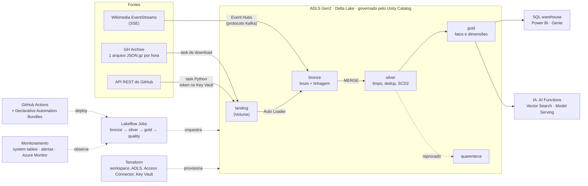

### 7. Lambda × Kappa 🧪

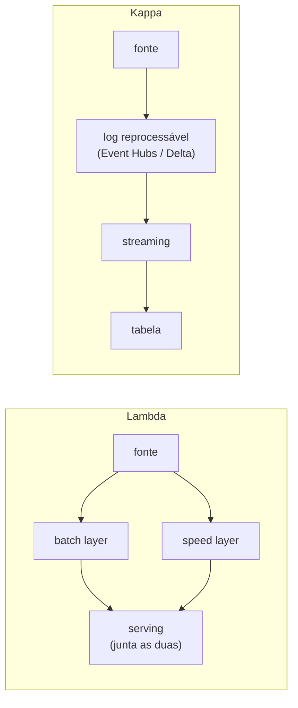

## 01 · Ambiente: Spark local, Databricks e Azure

Notebook: [`01_ambiente_local_databricks_azure.ipynb`](../notebooks/01_ambiente_local_databricks_azure.ipynb)

### 1. Driver, executor e cluster manager 🧪

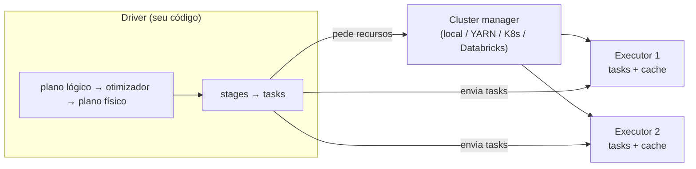

### 6. Spark Connect (conceito) 🧪/☁️

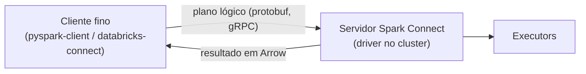

### 8. Azure Databricks: workspace, rede e segredos ☁️

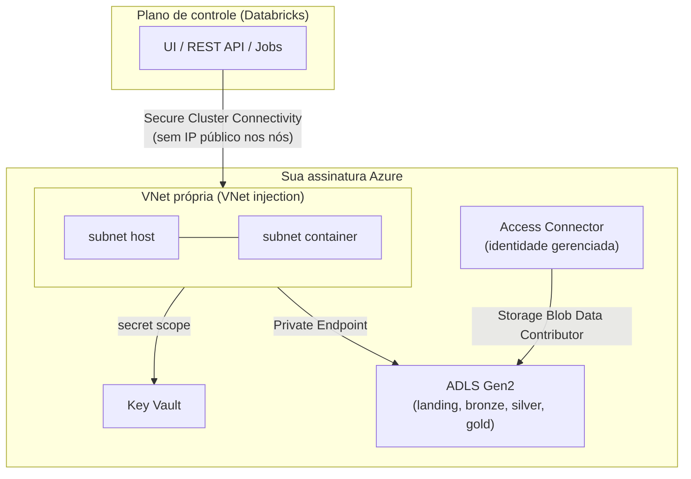

## 11 · Governança, Unity Catalog e LGPD

Notebook: [`11_governanca_unity_catalog_lgpd.ipynb`](../notebooks/11_governanca_unity_catalog_lgpd.ipynb)

### 1. Unity Catalog: a hierarquia e o namespace de três níveis ☁️

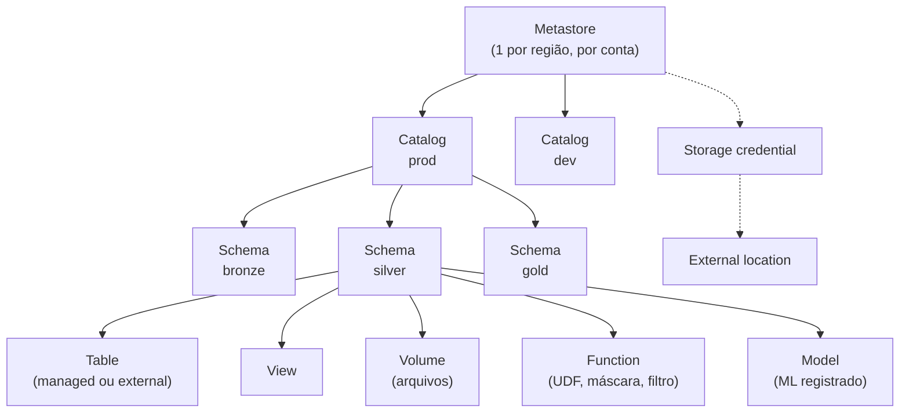

## 13 · Git, CI/CD e Declarative Automation Bundles

Notebook: [`13_cicd_git_asset_bundles.ipynb`](../notebooks/13_cicd_git_asset_bundles.ipynb)

### 6. Pirâmide de testes para dados 🧪

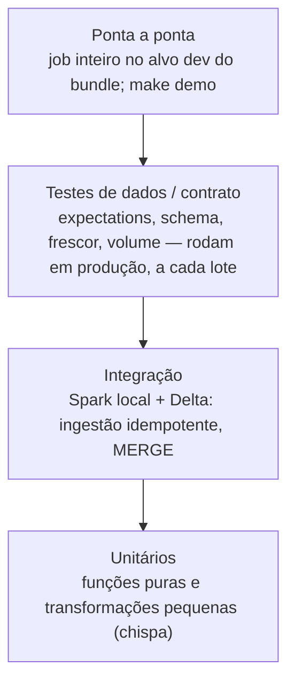

### 8. Declarative Automation Bundles: o job como código 🧪/☁️

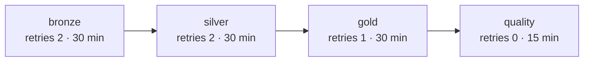

### 9. GitHub Actions: CI e deploy por ambiente 🧪/☁️

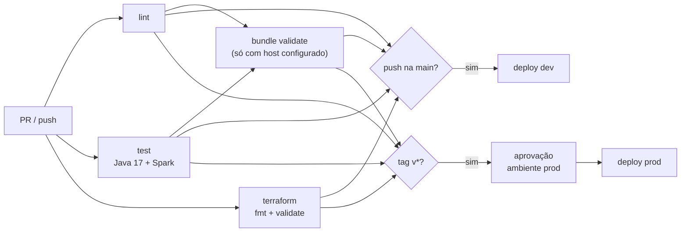

## 17 · Simulado de system design e troubleshooting

Notebook: [`17_simulado_system_design.ipynb`](../notebooks/17_simulado_system_design.ipynb)

### 2. Caso (a): ingestão de 1 TB/dia de eventos de app na Azure com Databricks

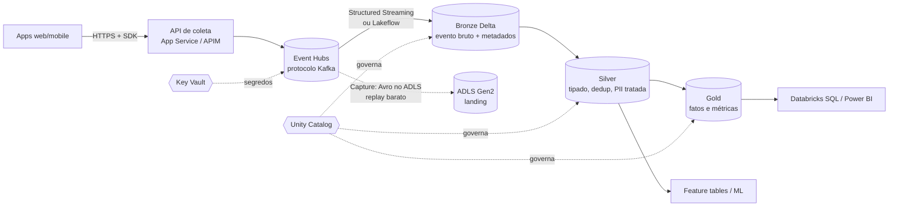

### 3. Caso (b): CDC de um banco transacional para o lakehouse

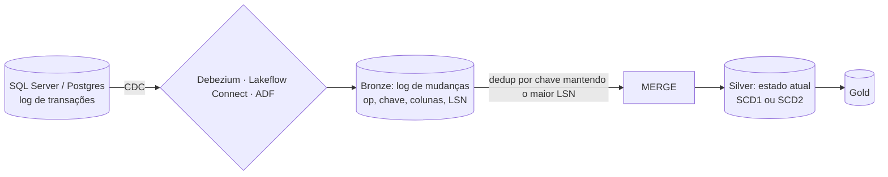

### 4. Caso (c): near-real-time para detecção de anomalia (SLA de minutos)

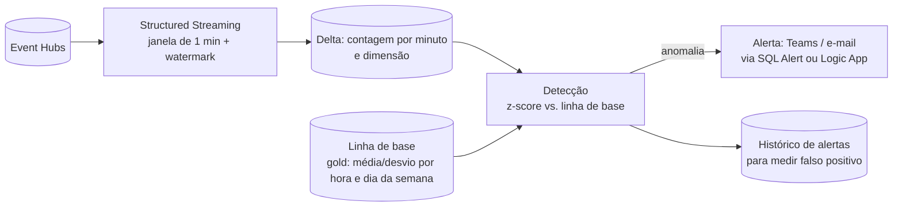

### 5. Caso (d): migração de um DW legado (SQL Server / Synapse) para o Databricks

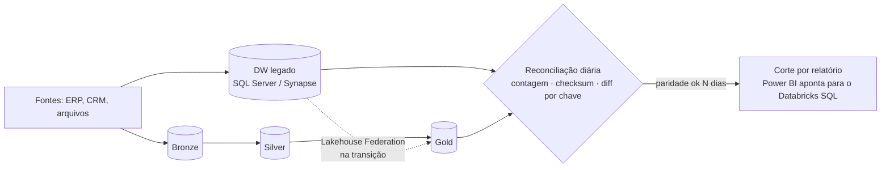
